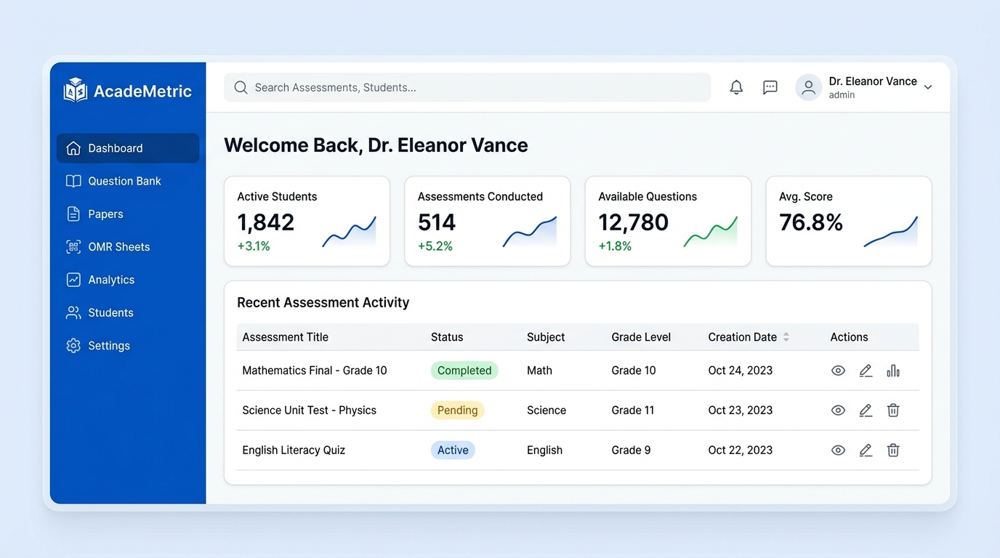

<div align="center">
  

  <h1>Testellect AI Assessment Platform</h1>
  
  <p>
    <strong>An open-source AI-powered competency assessment platform built for scale — runs fully offline, or with free cloud APIs like Groq.</strong>
  </p>

  <p>
    <a href="#features"></a>
    <a href="#tech-stack"></a>
    <a href="#installation"></a>
    <a href="#license"></a>
  </p>

  <p>
    <em>Generate competency-tagged questions, create OMR sheets, grade via computer vision, and view district-wide analytics—run fully offline at zero cost, or connect to free cloud APIs like Groq for faster inference.</em>
  </p>

  
</div>

<br />

## Project Overview

India's National Education Policy (NEP) 2020 mandates competency-based assessments via the PARAKH and NAS frameworks. However, government schools often lack the budget for cloud AI subscriptions or expensive pre-printed OMR sheets, and many operate in low-connectivity areas.

Testellect solves these problems by providing a flexible, privacy-first AI assessment ecosystem. It runs fully offline on school hardware for zero-cost, no-internet operation, or connects to free cloud APIs like Groq when internet access is available and faster inference is preferred — giving every school a path that fits their infrastructure.

---

## Key Features

### 1. Flexible AI Question Generation
*   **Offline or Cloud, Your Choice:** Runs on local open-source LLMs (Llama 3.1 / Qwen) via Ollama for zero-cost, no-internet operation — or connects to free cloud APIs like Groq for faster inference when internet is available. No OpenAI/Google API bills either way.
*   **Curriculum Aligned:** Upload GSEB chapter PDFs and let the AI extract concepts mapped directly to Bloom's Taxonomy.
*   **Multi-Language Mastery:** Automatically generates grammatically perfect MCQs in English, Hindi, and Gujarati with full Devanagari/Gujarati Unicode font support.

### 2. End-to-End Exam Management
*   **Exam Blueprints:** Design test structures defining competency distributions and difficulty ratios.
*   **Anti-Cheating Variants:** One click generates Set A, B, C, D with shuffled question orders.
*   **Primary School Image Bank:** Supports visual scenario-based questions for Grades 1–5, auto-linking uploaded images to generated questions.

### 3. Computer Vision OMR Grading
*   **Print on A4 Paper:** Generates custom OMR sheets embedded with QR codes that schools can print on standard A4 paper.
*   **Instant Grading:** Teachers scan filled sheets using any standard webcam or smartphone camera.
*   **OpenCV Powered:** Accurately detects filled bubbles and maps them to student roll numbers instantly.

### 4. Deep Competency Analytics
*   **Actionable Insights:** Tracks performance not just by total marks, but by specific competencies (e.g., Knowledge, Understanding, Application).
*   **Multi-Tier Dashboards:**
    *   **Teacher:** Class-level remediation tracking.
    *   **Principal:** School-wide subject comparisons.
    *   **DEO (District):** District-wide taluka heatmaps, school rankings, and automated alerts for underperforming zones.
*   **QR Data Sync:** Offline schools can sync their analytics to the District office simply by letting a visiting official scan a summary QR code off the screen.

---

## Tech Stack

<div align="center">

| Area | Technologies |
| :--- | :--- |
| **Frontend** | React 18, TypeScript, Vite, Tailwind CSS, shadcn/ui, Framer Motion |
| **Backend** | Python 3.12, FastAPI, SQLAlchemy 2.0, Pydantic v2 |
| **AI / ML** | Ollama (Local LLM) / Groq (Free Cloud API), ChromaDB (Vector DB), PyMuPDF |
| **Computer Vision** | OpenCV, NumPy |
| **Database** | PostgreSQL (Production) / SQLite (MVP) |
| **DevOps** | Docker, Docker Compose, Nginx |

</div>

---

## Quick Start (Docker)

The fastest way to get the platform running is via Docker. 

> **Prerequisites:** Docker, Docker Compose, and at least 16GB of RAM (32GB+ and an NVIDIA GPU recommended for fast AI inference).

```bash
# 1. Clone the repository
git clone https://github.com/Chunkpie/Testellect.git
cd Testellect

# 2. Build and start the containers
docker compose up -d --build
```

*Note: If running in offline mode, the system will automatically pull the required local AI model on first run. This is a large download and may take several minutes. Skip this entirely by configuring cloud mode with a free Groq API key instead (see Manual Development Setup below for details).*

### Access Points

Once the containers are running, access the platform at:

*   **Platform UI:** `http://localhost:80`
*   **Backend API Docs:** `http://localhost:8000/docs`

### Demo Credentials

| Role | Login Portal | Email | Password |
| :--- | :--- | :--- | :--- |
| **Teacher** | `/login` | `r.sharma@gseb.org` | `Teacher@123` |
| **Principal** | `/login` | `a.patel@gseb.org` | `Principal@123` |
| **DEO** | `/login` | `v.singh@gseb.org` | `Deo@123` |
| **System Admin** | `/login` | `admin@gseb.org` | `Admin@123` |

---

## Manual Development Setup

If you prefer to run the services locally without Docker for active development:

### 1. Start the Backend
```bash
cd backend
python -m venv venv
source venv/bin/activate  # Or `venv\Scripts\activate` on Windows
pip install -r requirements.txt
uvicorn app.main:app --reload
```

### 2. Start the Frontend
```bash
cd frontend
npm install
npm run dev
```

### 3. Choose Your AI Mode

**Offline mode** — you must have [Ollama](https://ollama.com/) installed locally on your machine.
```bash
ollama run qwen3:8b
```

**Cloud mode (optional)** — skip Ollama and instead add a free [Groq](https://groq.com/) API key to your backend `.env` file:
```bash
GROQ_API_KEY=your_free_groq_api_key
AI_PROVIDER=groq
```

---

## Security & Privacy Architecture

*   **Role-Based Access Control (RBAC):** Strict separation between School operations and District/Admin operations.
*   **JWT Authentication:** Uses secure, HttpOnly cookies for session management to prevent XSS token theft.
*   **Data Sovereignty:** In offline mode, nothing ever touches the public internet — all AI processing happens completely on-device. In cloud mode, only curriculum/question-generation prompts are sent to the API provider (e.g., Groq) — student names, marks, and grading data are never transmitted and are processed locally at all times.

---

## Repository Structure

```text
testellect/
├── backend/                  # FastAPI Application
│   ├── app/
│   │   ├── api/              # Route handlers
│   │   ├── core/             # Configuration & DB setup
│   │   ├── models/           # SQLAlchemy schemas
│   │   └── services/         # Core logic (AI, CV, PDF, Auth)
│   └── requirements.txt
├── frontend/                 # React Application
│   ├── src/
│   │   ├── api/              # Axios client functions
│   │   ├── components/       # Reusable UI components
│   │   ├── modules/          # Feature-based pages (OMR, Analytics, etc.)
│   │   └── stores/           # Zustand global state
│   └── package.json
├── docs/                     # Technical specifications & design docs
└── docker-compose.yml        # Orchestration configuration
```

---
<div align="center">
  <p>Engineered for the educators and students of Gujarat.</p>
</div>
                  