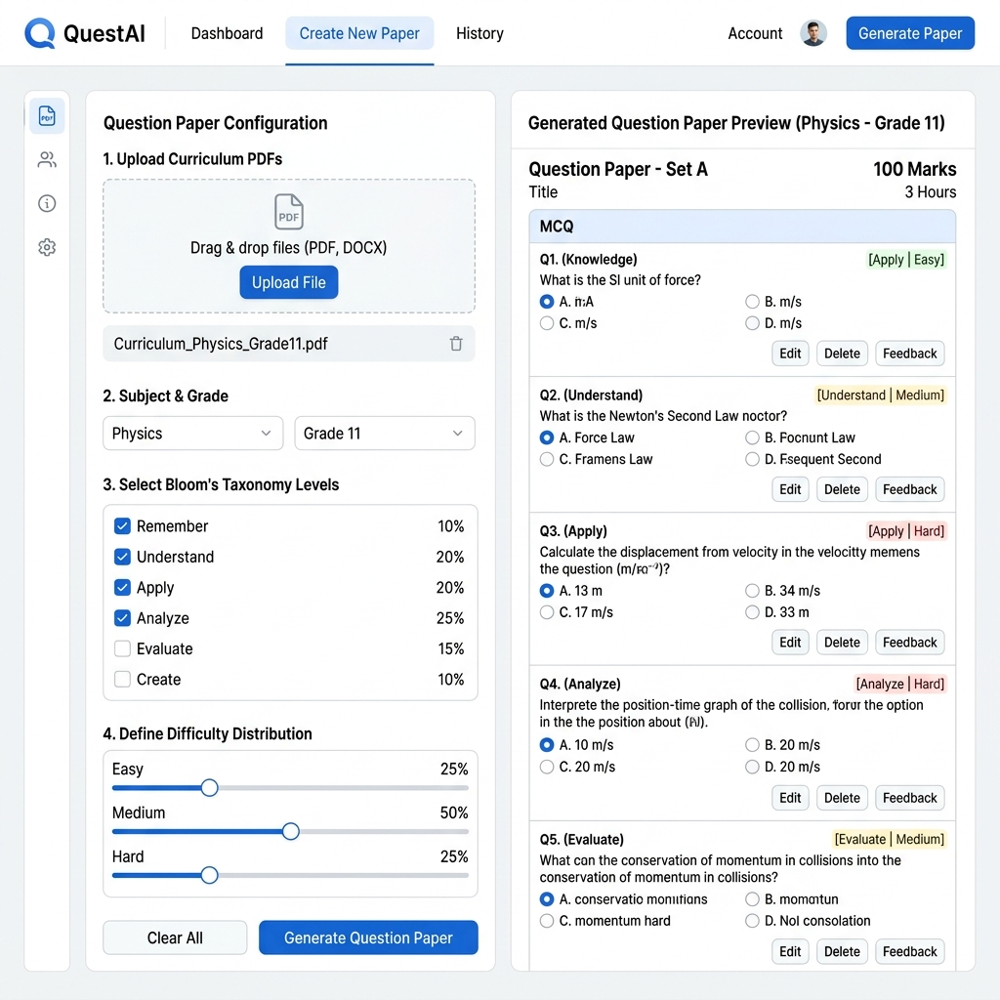
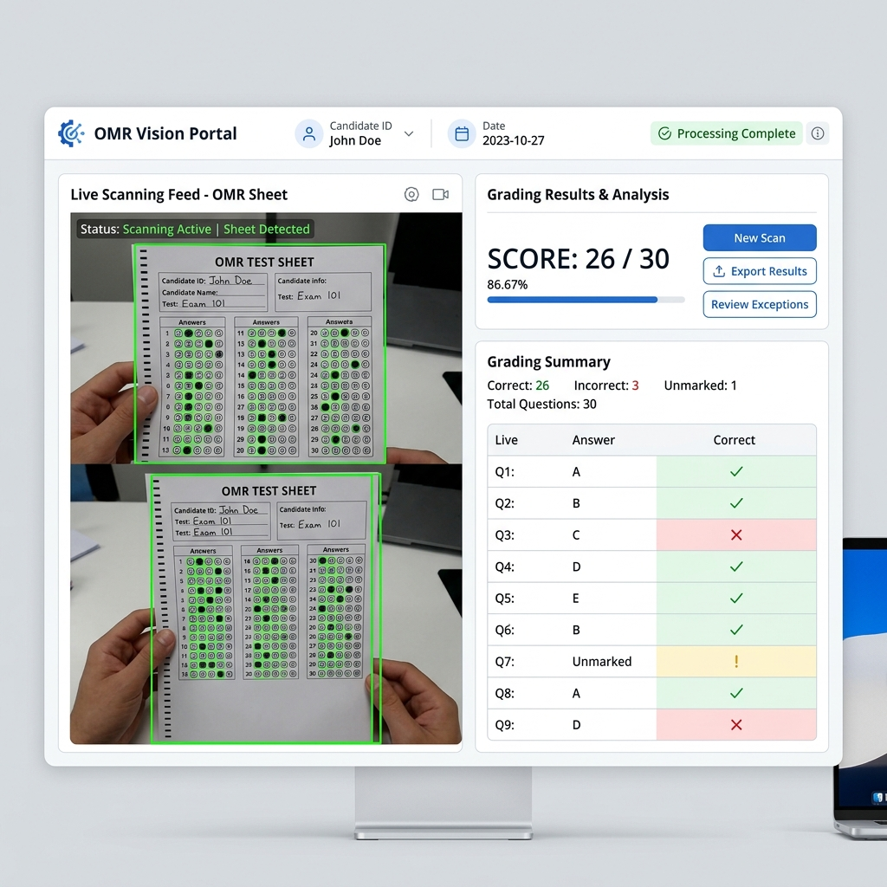
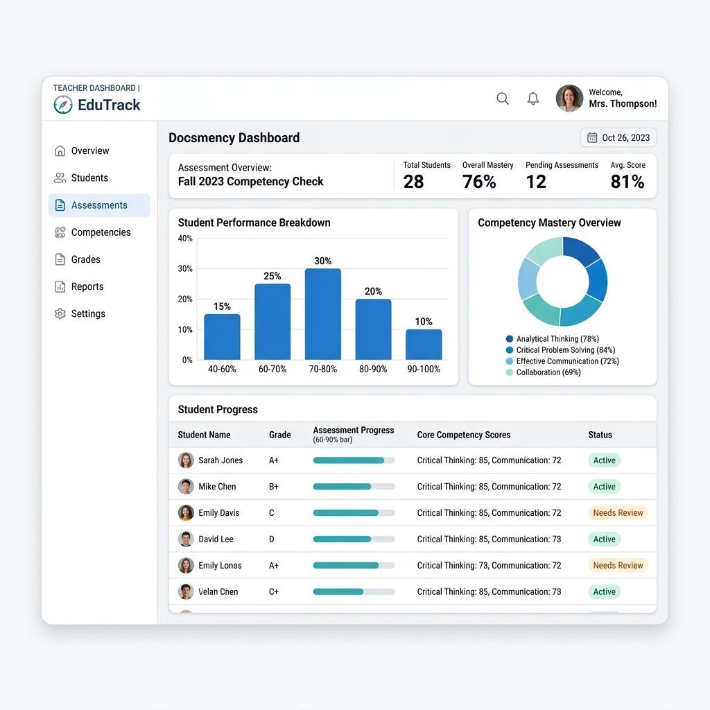

<div align="center">
  

  <h1>Testellect AI Assessment Platform</h1>
  
  <p>
    <strong>An open-source AI-powered competency assessment platform built for scale — runs fully offline, or with free cloud APIs.</strong>
  </p>

  <p>
    <a href="#features"></a>
    <a href="#tech-stack"></a>
    <a href="#installation"></a>
    <a href="#license"></a>
  </p>
</div>

<br />

## 📖 What is Testellect?

India's National Education Policy (NEP) 2020 mandates competency-based assessments. However, government schools often lack the budget for cloud AI subscriptions and many operate in low-connectivity areas. 

**Testellect** solves these problems by providing a flexible, privacy-first AI assessment ecosystem. It allows educators to:
1. Generate competency-tagged questions from curriculum PDFs.
2. Extract syllabus topics and map them directly to Bloom's Taxonomy.
3. Conduct district-wide analytics and evaluations.

It's designed to run **fully offline on school hardware for zero-cost** using local LLMs, or connect to free cloud APIs (like OpenRouter) when internet access is available. It bridges the digital divide, bringing state-of-the-art AI to the most remote classrooms.

---

## ⚡ Key Features

*   **Hybrid AI Generation:** The core AI pipeline uses local open-source LLMs (`llama3.2`) via Ollama for zero-cost, no-internet operation. If connected, it uses cloud models (e.g., `gemini-2.5-flash`) for faster generation.
*   **Curriculum Aligned & Extracted:** Upload GSEB chapter PDFs. The system extracts text (via PyMuPDF/pdfplumber), chunks it into ChromaDB, and extracts topics and concepts mapped to Bloom's Taxonomy.
*   **Automated Question Paper Generation:** Using Blueprints, the platform can auto-generate complete PDF question papers balancing various difficulty levels and competencies.

<p align="center">
  
</p>

*   **Multi-Language Mastery:** Automatically generates MCQs in English, Hindi, and Gujarati.
*   **Automated OMR Grading:** Integrated Computer Vision (OpenCV/PyZbar) for scanning student physical OMR sheets directly from a webcam or uploaded image, processing grades instantly.

<p align="center">
  
</p>

*   **📱 WhatsApp Bot Integration:** We've built a Twilio/WhatsApp Webhook integration! Teachers can simply snap a photo of the student's OMR sheet on their phone, send it to the WhatsApp Bot, and the background AI instantly grades it.
*   **Deep Competency Analytics & Reports:** Tracks performance across specific competencies (e.g., Knowledge, Understanding, Application). Generates downloadable PDF reports. Multi-tier dashboards cater to Teachers, Principals, and DEOs (District Education Officers) for remediation tracking and automated alerts.

<p align="center">
  
</p>

---

## ⚙️ How It Works (Technical Architecture)

Testellect is built on a modern, decoupled architecture.

### Data Flow
1. **Data Ingestion:** A teacher uploads a PDF curriculum chapter. 
2. **Vectorization:** The backend uses PyMuPDF to extract the text, which is embedded and stored into a local **ChromaDB**.
3. **Prompt Orchestration:** The user specifies the type of questions they want to generate. The backend's `pipeline_orchestrator.py` dynamically fetches relevant text chunks via Retrieval-Augmented Generation (RAG).
4. **AI Generation:** The prompt is sent to either the local Ollama instance (Offline Mode) or a cloud API (Online Mode). The LLM generates the JSON-structured MCQs.
5. **Storage & Serving:** The output is stored in PostgreSQL (or SQLite for lightweight setups) and served to the React frontend via FastAPI REST endpoints.

### Tech Stack
* **Frontend:** React 18, TypeScript, Vite, Tailwind CSS, shadcn/ui, Zustand (State), React Query.
* **Backend:** Python 3.12, FastAPI, SQLAlchemy (Async), Pydantic v2.
* **AI / ML Pipeline:** Ollama (Local LLM), OpenRouter (Cloud LLM), ChromaDB (Vector DB).
* **Computer Vision:** OpenCV, PyTesseract, PyZbar (for OMR and Barcode processing).
* **Database:** PostgreSQL 16 (or SQLite in lightweight mode).
* **DevOps:** Docker, Docker Compose.

---

## 🚀 How We Built It to Scale

Scalability was a primary design constraint, especially considering deployment in resource-constrained environments (like a legacy school laptop with 8GB RAM). 

1. **Zero-Config Standalone Containers:** We collapsed the architecture to just **two Docker containers** (`parakh-backend` and `parakh-ollama`). 
2. **Embedded Infrastructure:** 
   * The backend automatically falls back to SQLite via `aiosqlite` based on the `DB_MODE=sqlite` flag, bypassing heavy Postgres instances for local deployments.
   * ChromaDB is embedded directly inside the Python backend using `chromadb.PersistentClient`, dropping the need for a separate ChromaDB server.
3. **Offline Local LLM Optimizations:**
   * `OLLAMA_NUM_PARALLEL=1` and `OLLAMA_MAX_LOADED_MODELS=1` enforce absolute strict single-stream processing to prevent OOM (Out Of Memory) crashes.
   * Parallel Python `asyncio.gather` pipeline queues execute sequentially behind an `asyncio.Semaphore(1)` bottleneck.
   * Inference context window sizes are strictly gated dynamically.
   * Model routing assigns simple text extraction to a 1B parameter model and generation tasks to a 3B parameter model to conserve RAM.
4. **Cloud Scalability (District/State Level):** If deployed in the cloud, the FastAPI backend is fully asynchronous and stateless, ready to be scaled horizontally via Kubernetes. PostgreSQL handles concurrent scaling naturally.

---

## 🔒 Security & Privacy Architecture

*   **Role-Based Access Control (RBAC):** Strict separation between School operations and District/Admin operations.
*   **JWT Authentication:** Uses secure, HttpOnly cookies for session management to prevent XSS token theft.
*   **Data Sovereignty:** In offline mode, nothing ever touches the public internet — all AI processing happens completely on-device. In cloud mode, only curriculum/question-generation prompts are sent to the API provider — student names, marks, and grading data are never transmitted.

---

## 🛠️ Quick Start (Docker)

The fastest way to get the platform running is via Docker.

> **Prerequisites:** Docker, Docker Compose.

```bash
# 1. Navigate into the folder
cd TestEllect

# 2. Build and start the containers in detached mode
docker compose up -d --build

# 3. CRITICAL: Pull the offline AI model (if using offline mode)
docker exec parakh-ollama ollama pull llama3.2
```

*Note: The `llama3.2` model is approximately 2GB. You must run the `ollama pull` command for the offline AI pipelines to function properly.*

### Access Points
*   **Platform UI:** `http://localhost:8000` (Static files served via backend, or `http://localhost:5173` if running Vite dev server)
*   **Backend API Docs:** `http://localhost:8000/docs`

### Demo Credentials
| Role | Login Portal | Email | Password |
| :--- | :--- | :--- | :--- |
| **Teacher** | `/login` | `r.sharma@gseb.org` | `Teacher@123` |
| **Principal** | `/login` | `a.patel@gseb.org` | `Principal@123` |
| **DEO** | `/login` | `v.singh@gseb.org` | `Deo@123` |
| **System Admin** | `/login` | `admin@gseb.org` | `Admin@123` |

---

## 💻 Manual Development Setup

If you prefer to run the services locally without Docker for active development:

### 1. Start the Backend
```bash
cd backend
python -m venv venv
source venv/bin/activate  # Or `venv\Scripts\activate` on Windows
pip install -r requirements.txt
uvicorn app.main:app --reload
```

### 2. Start the Frontend
```bash
cd frontend
npm install
npm run dev
```

---

## 🔮 What's Next / Future Scope
* **Predictive Analytics:** Using historical student performance to predict dropout risks or failure rates in upcoming standardized tests.
* **Regional Language Audio Output:** Text-to-speech for visually impaired students to take competency assessments audibly.

---

<div align="center">
  <p>Engineered for the educators and students.</p>
</div>